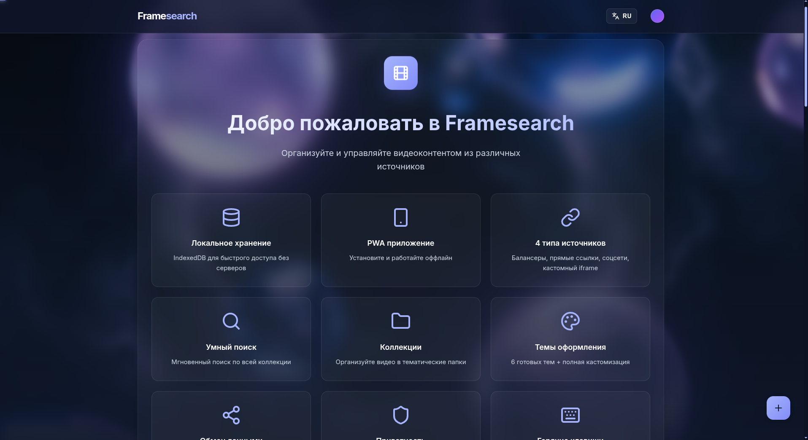

# 🎬 Framesearch

<div align="center">


**Персональное видеохранилище для управления вашей коллекцией**

[](LICENSE)
[](CHANGELOG.md)
[](manifest.json)
[](scripts/i18n.js)

[🇷🇺 Русский](README.md) | [🇬🇧 English](README_EN.md)

</div>

---

## О проекте

**Framesearch** — это современное веб-приложение для организации и управления личной коллекцией видеоконтента. Все данные хранятся локально в браузере, обеспечивая полную конфиденциальность и автономность работы.

## 📸 Скриншот

<div align="center">



</div>

---

### ✨ Ключевые особенности

- 🗄️ **Локальное хранение** — все данные в IndexedDB, без серверов
- 🌐 **PWA приложение** — установка на устройство, работа оффлайн
- 🎨 **7 готовых тем** + полная кастомизация цветов
- 🔍 **Мгновенный поиск** по названию, описанию, году
- 📁 **Коллекции** — организация видео в тематические папки
- ⭐ **Избранное** — быстрый доступ к любимым фильмам
- 🔄 **Импорт/Экспорт** — резервное копирование и обмен данными
- 🔐 **Шифрование** — защита данных при экспорте
- 🌍 **Мультиязычность** — русский и английский интерфейс
- 🎯 **4 типа источников** — балансеры, прямые ссылки, соцсети, custom iframe

### 🆕 Новое в v5.0.0

- 📊 **Статистика и аналитика** — отслеживание просмотров, топ-10 видео, графики активности за 14 дней
- 🏷️ **Умная система тегов** — организация по тегам, автоподсказки, облако тегов, поиск по тегам
- 📝 **Заметки с таймкодами** — добавление заметок к видео с привязкой ко времени, экспорт в текст
- 🎭 **Режим слайдшоу** — автоматическая презентация постеров в полноэкранном режиме с настройками

---

## Быстрый старт

### Установка

1. **Клонируйте репозиторий:**
```bash
git clone https://github.com/SerGioPlay01/framesearch.git
cd framesearch
```

2. **Откройте в браузере:**
```bash
# Используйте любой локальный сервер, например:
python -m http.server 8000
# или
npx serve
```

3. **Перейдите по адресу:**
```
http://localhost:8000
```

### Использование

1. **Добавьте первое видео** — нажмите кнопку "+" в правом нижнем углу
2. **Заполните информацию** — название, описание, год, рейтинг
3. **Выберите источник** — балансер, прямая ссылка, соцсеть или custom
4. **Вставьте URL** — ссылку на видео из выбранного источника
5. **Сохраните** — видео появится в вашей коллекции

---

## 📚 Документация

### 🔧 Переиспользуемые компоненты

Framesearch включает несколько независимых компонентов, которые можно использовать в ваших проектах:

- **[Logger](docs/logger.md)** — Система красивого логирования с цветным выводом и историей
- **[Dialog](docs/dialog.md)** — Красивые модальные диалоги (alert, confirm, prompt) с async/await
- **[i18n](docs/i18n.md)** — Легковесная система интернационализации с динамической сменой языка
- **[Cookie Consent](docs/cookie-consent.md)** — GDPR-совместимый виджет согласия на cookies
- **[Music Support](docs/music-support.md)** — Поддержка музыкальных источников (Spotify, Apple Music, Yandex Music)

Каждый компонент полностью автономен и может быть использован отдельно от основного проекта.

### Статистика и аналитика

**Отслеживание просмотров:**
- Автоматическая запись при просмотре видео
- Учет времени просмотра (минимум 5 секунд)
- История всех просмотров

**Аналитика:**
- Общая статистика: количество просмотров, уникальных видео, общее время
- Топ-10 самых просматриваемых видео
- График активности за последние 14 дней
- Статистика за неделю

### 🏷️ Система тегов

**Организация контента:**
- Добавление неограниченного количества тегов
- Автоподсказки при вводе (на основе существующих тегов)
- Облако тегов для визуализации
- Поиск видео по тегам

**Использование:**
- Добавляйте теги через модальное окно на карточке видео
- Кликайте на теги в облаке для поиска
- Используйте теги для категоризации контента

### 📝 Заметки с таймкодами

**Функции:**
- Добавление текстовых заметок к видео
- Привязка заметок к конкретному времени (таймкод)
- Быстрый переход по таймкодам
- Редактирование и удаление заметок
- Экспорт всех заметок в текстовый файл

**Формат таймкода:**
- `MM:SS` — минуты:секунды (например, 1:23)
- `HH:MM:SS` — часы:минуты:секунды (например, 1:23:45)

### 🎭 Режим слайдшоу

**Возможности:**
- Полноэкранная презентация постеров
- Автоматическое переключение слайдов
- Настройка длительности (3-30 секунд)
- Случайный порядок показа
- Отображение информации о видео
- Управление с клавиатуры

**Горячие клавиши в слайдшоу:**
- `→` / `Пробел` — следующий слайд
- `←` — предыдущий слайд
- `P` — пауза/воспроизведение
- `I` — показать/скрыть информацию
- `Esc` — выход из слайдшоу

### Типы источников видео

#### 🎭 Балансеры
Видеобалансеры с поддержкой множества фильмов и сериалов:
- **Kodik** — `https://kodik.info/...`
- **Collaps** — `https://collaps.cc/...`
- **Alloha** — `https://alloha.tv/...`
- **HDRezka** — `https://hdrezka.ag/...`

#### 🔗 Прямые ссылки
Прямые URL на видеофайлы:
- MP4, WebM, OGG файлы
- Стриминговые ссылки
- CDN ресурсы

#### 📱 Соцсети
Встраивание из популярных платформ:
- **YouTube** — `https://youtube.com/watch?v=...`
- **VK Video** — `https://vk.com/video...`
- **RuTube** — `https://rutube.ru/video/...`
- **Vimeo** — `https://vimeo.com/...`

#### 🎵 Музыка
Поддержка музыкальных платформ:
- **Spotify** — `https://open.spotify.com/...`
- **Apple Music** — `https://music.apple.com/...`
- **Yandex Music** — `https://music.yandex.ru/...`

#### ⚙️ Custom
Любой iframe код для встраивания

### Коллекции

Организуйте видео в тематические папки:
- Создавайте неограниченное количество коллекций
- Перемещайте видео между коллекциями
- Фильтруйте по коллекциям
- Удаляйте коллекции (видео сохраняются)

### Темы оформления

**7 готовых тем:**
1. 🌙 **Темная элегантность** — классический темный стиль
2. ✨ **Фиолетовая ночь** — мягкие фиолетовые тона
3. 🌊 **Океанская свежесть** — голубые и бирюзовые оттенки
4. 🌅 **Закатное сияние** — теплые оранжевые тона
5. 🌲 **Лесная тишина** — успокаивающие зеленые цвета
6. 💖 **Розовая мечта** — нежные розовые оттенки
7. ⚫ **Monochrome** — минималистичный черно-белый

**Кастомизация:**
- Настройка всех цветов интерфейса
- Скругление углов (0-24px)
- Масштаб при наведении (1.00-1.15)
- Предпросмотр в реальном времени

### Импорт и Экспорт

**Экспорт данных:**
- JSON формат со всеми данными
- Опциональное шифрование паролем (AES-256)
- Резервное копирование коллекции

**Импорт данных:**
- Загрузка из JSON файла
- Автоматическая расшифровка
- Слияние с существующими данными

### Обмен коллекциями

**Поделиться видео:**
1. Нажмите кнопку "Поделиться" на карточке
2. Получите 6-значный код
3. Отправьте код другу

**Импортировать по коду:**
1. Откройте импорт
2. Введите полученный код
3. Видео добавится в коллекцию

---

## ⌨️ Горячие клавиши

| Клавиша | Действие |
|---------|----------|
| `Ctrl + K` | Открыть поиск |
| `Ctrl + N` | Добавить новое видео |
| `Esc` | Закрыть модальное окно |
| `/` | Фокус на поиске |

---

## 🛠️ Технологии

- **Vanilla JavaScript** — без фреймворков
- **IndexedDB** — локальное хранилище данных
- **Service Worker** — оффлайн работа и кэширование
- **Web Crypto API** — шифрование данных
- **Lucide Icons** — современные иконки
- **Google Fonts (Inter, Roboto)** — типографика

---

## 📱 PWA установка

### Desktop (Chrome/Edge)
1. Откройте приложение в браузере
2. Нажмите иконку установки в адресной строке
3. Или: Меню → "Установить Framesearch"

### Android
1. Откройте в Chrome
2. Меню → "Добавить на главный экран"
3. Подтвердите установку

### iOS (Safari)
1. Откройте в Safari
2. Нажмите "Поделиться"
3. "На экран Домой"

---

## 🔒 Конфиденциальность

- ✅ Все данные хранятся локально
- ✅ Нет серверов и баз данных
- ✅ Нет отслеживания и аналитики
- ✅ Нет сторонних скриптов
- ✅ Полный контроль над данными

---

## 📄 Лицензия

Проект распространяется под лицензией **MIT**. Подробности в файле [LICENSE](LICENSE).

---

## 👨‍💻 Автор

**SerGioPlay**

- 🌐 Сайт: [sergioplay-dev.vercel.app](https://sergioplay-dev.vercel.app/)
- 💻 GitHub: [@SerGioPlay01](https://github.com/SerGioPlay01)
- 📦 Проект: [framesearch](https://github.com/SerGioPlay01/framesearch)

---

## 🤝 Поддержка

Если у вас возникли вопросы или предложения:

- 📧 VK: [vk.com/framesearch_ru](https://vk.com/framesearch_ru)
- 💬 Telegram: [t.me/framesearch_ru](https://t.me/framesearch_ru)
- 🐛 Issues: [GitHub Issues](https://github.com/SerGioPlay01/framesearch/issues)

---

## ⭐ Благодарности

Спасибо всем, кто использует и поддерживает проект!

Если вам нравится Framesearch, поставьте ⭐ на GitHub!

---

<div align="center">

**© 2026 Framesearch. Все права защищены.**

Made with ❤️ by SerGioPlay

</div>
