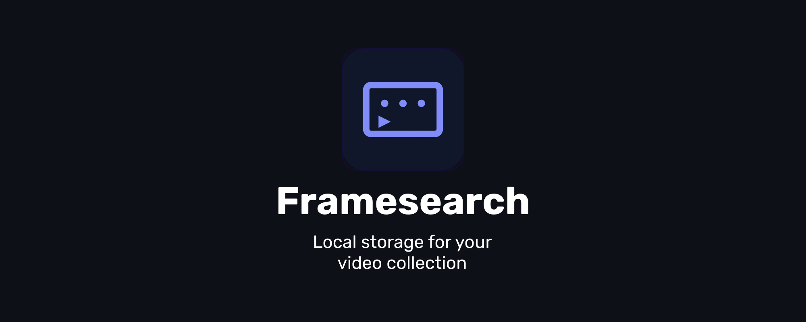

# 🎬 Framesearch

<div align="center">


**Personal video storage for managing your collection**

[](LICENSE)
[](manifest.json)
[](scripts/i18n.js)

[🇷🇺 Русский](README.md) | [🇬🇧 English](README_EN.md)

</div>

---

## 📖 About

**Framesearch** is a modern web application for organizing and managing your personal video content collection. All data is stored locally in the browser, ensuring complete privacy and autonomy.

## 📸 Screenshot

<div align="center">



</div>

---

## ✨ Key Features

- 🗄️ **Local Storage** — all data in IndexedDB, no servers
- 🌐 **PWA Application** — install on device, work offline
- 🎨 **7 Ready Themes** + full color customization
- 🔍 **Instant Search** by title, description, year
- 📁 **Collections** — organize videos into thematic folders
- ⭐ **Favorites** — quick access to favorite movies
- 🔄 **Import/Export** — backup and data sharing
- 🔐 **Encryption** — data protection on export
- 🌍 **Multilingual** — Russian and English interface
- 🎯 **4 Source Types** — balancers, direct links, social media, custom iframe

---

## 🚀 Quick Start

### Installation

1. **Clone the repository:**
```bash
git clone https://github.com/SerGioPlay01/framesearch.git
cd framesearch
```

2. **Open in browser:**
```bash
# Use any local server, for example:
python -m http.server 8000
# or
npx serve
```

3. **Navigate to:**
```
http://localhost:8000
```

### Usage

1. **Add first video** — click the "+" button in the bottom right corner
2. **Fill in information** — title, description, year, rating
3. **Choose source** — balancer, direct link, social media or custom
4. **Paste URL** — link to video from chosen source
5. **Save** — video will appear in your collection

---

## 📚 Documentation

### 🔧 Reusable Components

Framesearch includes several independent components that can be used in your projects:

- **[Logger](docs/logger.md)** — Beautiful logging system with colored output and history
- **[Dialog](docs/dialog.md)** — Beautiful modal dialogs (alert, confirm, prompt) with async/await
- **[i18n](docs/i18n.md)** — Lightweight internationalization system with dynamic language switching

Each component is fully autonomous and can be used separately from the main project.

### Video Source Types

#### 🎭 Balancers
Video balancers with support for many movies and series:
- **Kodik** — `https://kodik.info/...`
- **Collaps** — `https://collaps.cc/...`
- **Alloha** — `https://alloha.tv/...`
- **HDRezka** — `https://hdrezka.ag/...`
- **Vibix** — `https://vibix.org/...`

#### 🔗 Direct Links
Direct URLs to video files:
- MP4, WebM, OGG files
- Streaming links
- CDN resources

#### 📱 Social Media
Embedding from popular platforms:
- **YouTube** — `https://youtube.com/watch?v=...`
- **VK Video** — `https://vk.com/video...`
- **RuTube** — `https://rutube.ru/video/...`
- **Vimeo** — `https://vimeo.com/...`

#### ⚙️ Custom
Any iframe code for embedding

### Collections

Organize videos into thematic folders:
- Create unlimited collections
- Move videos between collections
- Filter by collections
- Delete collections (videos are preserved)

### Themes

**7 Ready Themes:**
1. 🌙 **Dark Elegance** — classic dark style
2. ✨ **Purple Night** — soft purple tones
3. 🌊 **Ocean Fresh** — blue and turquoise shades
4. 🌅 **Sunset Glow** — warm orange tones
5. 🌲 **Forest Silence** — calming green colors
6. 💖 **Pink Dream** — gentle pink shades
7. ⚫ **Monochrome** — minimalist black and white

**Customization:**
- Customize all interface colors
- Border radius (0-24px)
- Hover scale (1.00-1.15)
- Real-time preview

### Import and Export

**Export Data:**
- JSON format with all data
- Optional password encryption (AES-256)
- Collection backup

**Import Data:**
- Load from JSON file
- Automatic decryption
- Merge with existing data

### Share Collections

**Share Video:**
1. Click "Share" button on card
2. Get 6-digit code
3. Send code to friend

**Import by Code:**
1. Open import
2. Enter received code
3. Video will be added to collection

---

## ⌨️ Keyboard Shortcuts

| Key | Action |
|-----|--------|
| `Ctrl + K` | Open search |
| `Ctrl + N` | Add new video |
| `Esc` | Close modal |

---

## 🛠️ Technologies

- **Vanilla JavaScript** — no frameworks
- **IndexedDB** — local data storage
- **Service Worker** — offline work and caching
- **Web Crypto API** — data encryption
- **Lucide Icons** — modern icons
- **Google Fonts (Inter)** — typography

---

## 📱 PWA Installation

### Desktop (Chrome/Edge)
1. Open app in browser
2. Click install icon in address bar
3. Or: Menu → "Install Framesearch"

### Android
1. Open in Chrome
2. Menu → "Add to Home screen"
3. Confirm installation

### iOS (Safari)
1. Open in Safari
2. Tap "Share"
3. "Add to Home Screen"

---

## 🔒 Privacy

- ✅ All data stored locally
- ✅ No servers and databases
- ✅ No tracking and analytics
- ✅ No third-party scripts
- ✅ Full control over data

---

## 📄 License

Project is distributed under **MIT** license. Details in [LICENSE](LICENSE) file.

---

## 👨‍💻 Author

**SerGioPlay**

- 🌐 Website: [sergioplay-dev.vercel.app](https://sergioplay-dev.vercel.app/)
- 💻 GitHub: [@SerGioPlay01](https://github.com/SerGioPlay01)
- 📦 Project: [framesearch](https://github.com/SerGioPlay01/framesearch)

---

## 🤝 Support

If you have questions or suggestions:

- 📧 VK: [vk.com/framesearch_ru](https://vk.com/framesearch_ru)
- 💬 Telegram: [t.me/framesearch_ru](https://t.me/framesearch_ru)
- 🐛 Issues: [GitHub Issues](https://github.com/SerGioPlay01/framesearch/issues)

---

## ⭐ Acknowledgments

Thanks to everyone who uses and supports the project!

If you like Framesearch, give it a ⭐ on GitHub!

---

<div align="center">

**© 2026 Framesearch. All rights reserved.**

Made with ❤️ by SerGioPlay

</div>
